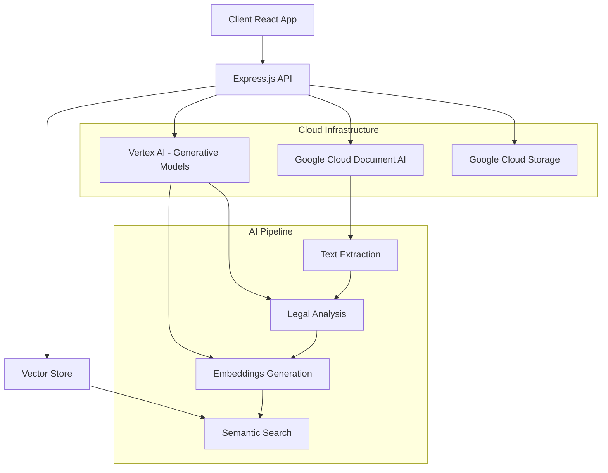

# 🏛️ Legal AI Platform - SPARK182

<div align="center">

[](https://github.com/bhargav-abhay/legal-document)
[](LICENSE)
[](https://nodejs.org/)
[](https://reactjs.org/)
[](https://cloud.google.com/)
[](https://cloud.google.com/vertex-ai)

**🚀 AI-Powered Legal Document Analysis Platform**

*Transforming complex legal documents into plain English insights using cutting-edge Generative AI*

<div style="background: linear-gradient(135deg, #667eea 0%, #764ba2 100%); padding: 20px; border-radius: 16px; margin: 20px 0;">

[🌟 **Live Demo**](https://document-legal.web.app/) • [🎯 **Features**](#features) • [🚀 **Quick Start**](#quick-start)

</div>

</div>

---

<div style="background: linear-gradient(135deg, #f093fb 0%, #f5576c 100%); padding: 2px; border-radius: 16px; margin: 20px 0;">
<div style="background: #0D1117; padding: 30px; border-radius: 14px;">

## 🌟 Overview

The Legal AI Platform revolutionizes legal document analysis by leveraging Google Cloud's advanced AI services to make complex legal documents accessible to everyone. Built for the SPARK182 hackathon, this solution transforms legal jargon into actionable insights through intelligent AI processing.

### 🎯 Problem Statement
- Legal documents are complex and intimidating for non-legal professionals
- Traditional legal consultation is expensive (avg. $300-500/hour)
- Document review is time-consuming and prone to human error
- Small businesses and individuals lack access to affordable legal analysis

### 💡 Our Solution
AI-powered platform that democratizes legal document understanding through:
- **Instant Analysis**: Upload → AI Processing → Plain English Insights
- **Smart Search**: RAG-powered document querying with contextual answers
- **Risk Assessment**: Automated compliance and risk factor identification
- **Cost Effective**: 95% cost reduction compared to traditional legal consultation

</div>
</div>

---

## ✨ Features

<div style="background: linear-gradient(135deg, #4facfe 0%, #00f2fe 100%); padding: 2px; border-radius: 16px; margin: 20px 0;">
<div style="background: #0D1117; padding: 20px; border-radius: 14px;">

<table>
<tr>
<td width="50%">

### 📄 Document Analysis
<div style="border-left: 4px solid #10B981; padding-left: 16px;">

- **Multi-format Support**: PDF, DOC, DOCX, TXT, RTF
- **AI Text Extraction**: Google Cloud Document AI
- **Intelligent Parsing**: Clause identification & categorization
- **Risk Assessment**: Automated compliance checking
- **Plain English**: Legal jargon translation

</div>
</td>
<td width="50%">

### 🔍 Intelligent Search
<div style="border-left: 4px solid #06B6D4; padding-left: 16px;">

- **RAG Architecture**: Retrieval-Augmented Generation
- **Semantic Search**: Vector similarity matching
- **Contextual Answers**: Natural language queries
- **Source Attribution**: Clickable references
- **Cross-Document**: Search entire corpus

</div>
</td>
</tr>
<tr>
<td width="50%">

### 📊 Analytics Dashboard
<div style="border-left: 4px solid #7C3AED; padding-left: 16px;">

- **Real-time Metrics**: Processing statistics
- **Visual Charts**: Interactive data visualization
- **Performance Tracking**: Accuracy & speed monitoring
- **User Insights**: Engagement analytics
- **System Health**: Uptime & error tracking

</div>
</td>
<td width="50%">

### 🌐 Modern Web App
<div style="border-left: 4px solid #F97316; padding-left: 16px;">

- **Progressive Web App**: Mobile-responsive design
- **Real-time Updates**: WebSocket connections
- **Dark Theme**: Modern glassmorphism UI
- **Authentication**: Secure OAuth integration
- **Export Options**: PDF reports & data export

</div>
</td>
</tr>
</table>

</div>
</div>

---

## 🏗️ Architecture



### 🛠️ Tech Stack

**Frontend**
```bash
React 18          # Modern UI framework
Tailwind CSS      # Utility-first styling
Recharts          # Data visualization
Lucide React      # Icon library
Context API       # State management
WebSocket         # Real-time updates
```

**Backend**
```bash
Node.js           # Runtime environment
Express.js        # Web framework
Multer            # File upload handling
Google Cloud AI   # AI/ML services
WebSocket Server  # Real-time communication
CORS              # Cross-origin security
```

**AI/ML Services**
```bash
Document AI       # Text extraction
Vertex AI         # Generative models
  ├── text-bison@002    # Legal analysis
  └── text-embedding-004 # Vector embeddings
RAG Architecture  # Semantic search
Vector Store      # In-memory similarity
```

---

## 🚀 Quick Start

### Prerequisites
- Node.js 18+ and npm
- Google Cloud Project with billing enabled
- Document AI and Vertex AI APIs activated

### 1️⃣ Clone Repository
```bash
git clone https://github.com/bhargav-abhay/legal-document.git
cd legal-document
```

### 2️⃣ Install Dependencies
```bash
# Backend dependencies
npm install

# Frontend dependencies
cd frontend
npm install
cd ..
```

### 3️⃣ Environment Setup
Create `.env` file in root directory:

```env
# Google Cloud Configuration
GOOGLE_CLOUD_PROJECT=your-project-id
GOOGLE_APPLICATION_CREDENTIALS=path/to/service-account.json
VERTEX_AI_LOCATION=us-central1
DOCUMENT_AI_LOCATION=us
DOCUMENT_AI_PROCESSOR_ID=your-processor-id
STORAGE_BUCKET_NAME=your-bucket-name

# API Configuration
PORT=8000
FRONTEND_URL=http://localhost:3000

# Optional: Google Search API for legal news
GOOGLE_SEARCH_API_KEY=your-api-key
GOOGLE_SEARCH_ENGINE_ID=your-engine-id
```

### 4️⃣ Google Cloud Setup
```bash
# Install Google Cloud CLI
curl https://sdk.cloud.google.com | bash
exec -l $SHELL

# Authenticate
gcloud auth login
gcloud config set project YOUR_PROJECT_ID

# Enable required APIs
gcloud services enable documentai.googleapis.com
gcloud services enable aiplatform.googleapis.com
gcloud services enable storage.googleapis.com

# Create service account
gcloud iam service-accounts create legal-ai-service
gcloud projects add-iam-policy-binding YOUR_PROJECT_ID \
  --member="serviceAccount:legal-ai-service@YOUR_PROJECT_ID.iam.gserviceaccount.com" \
  --role="roles/documentai.apiUser"
gcloud projects add-iam-policy-binding YOUR_PROJECT_ID \
  --member="serviceAccount:legal-ai-service@YOUR_PROJECT_ID.iam.gserviceaccount.com" \
  --role="roles/aiplatform.user"

# Download service account key
gcloud iam service-accounts keys create ./service-account.json \
  --iam-account=legal-ai-service@YOUR_PROJECT_ID.iam.gserviceaccount.com
```

### 5️⃣ Start Development Servers
```bash
# Terminal 1: Start backend server
npm start

# Terminal 2: Start React development server
cd frontend
npm start
```

Visit `http://localhost:3000` to access the application.

---

## 📚 API Documentation

### Document Analysis Endpoint
```http
POST /api/analyze-document
Content-Type: multipart/form-data

# Request
- file: Document file (PDF, DOC, DOCX, TXT, RTF)
- userI